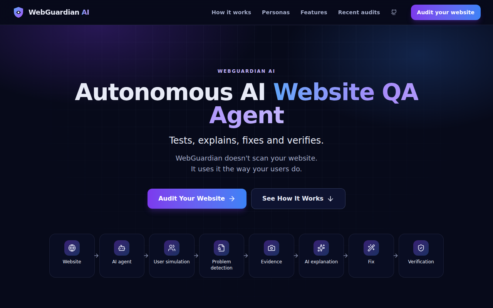
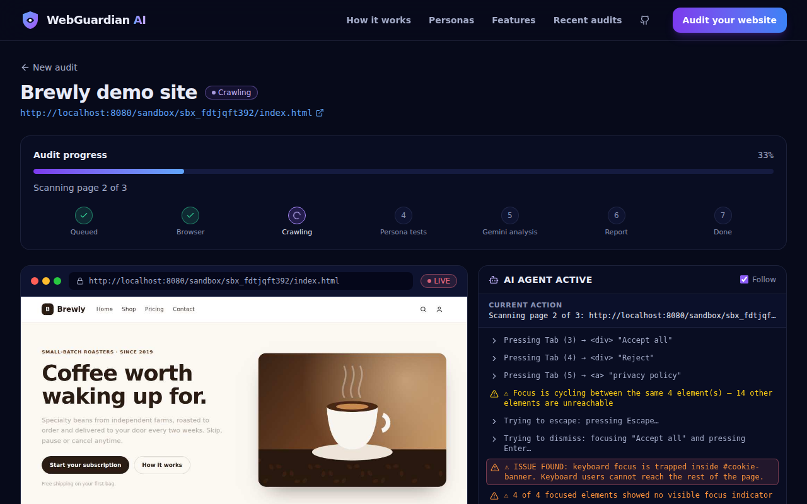
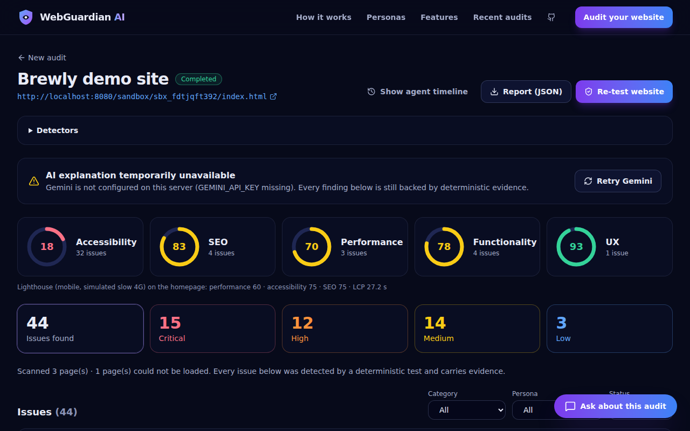
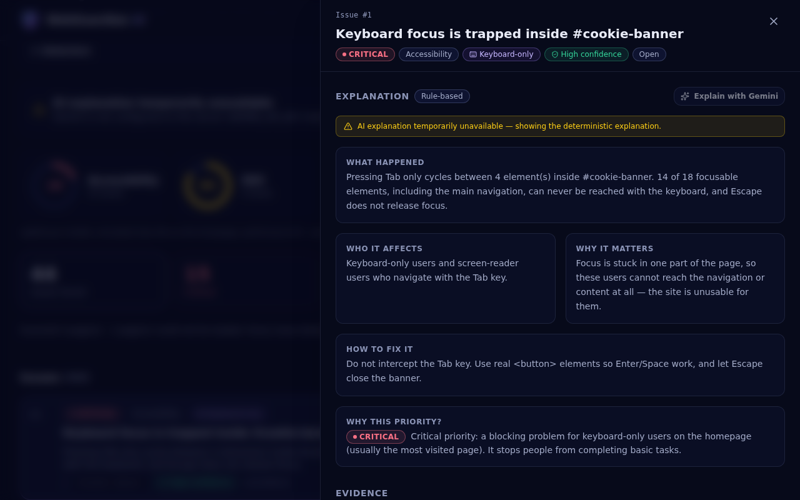
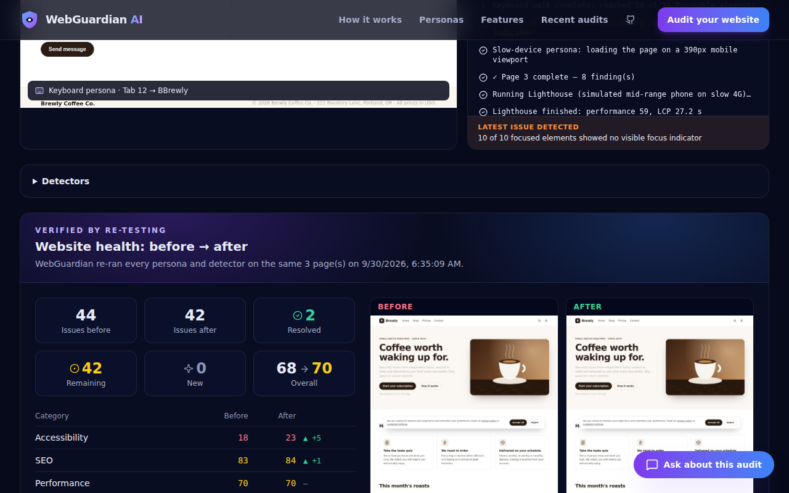
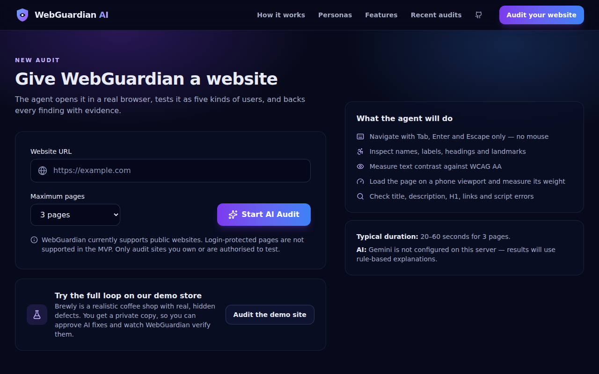

<div align="center">


# WebGuardian AI

### Autonomous AI Website QA Agent — *Tests, explains, fixes and verifies.*

**WebGuardian doesn't scan your website. It uses it the way your users do.**

[Live demo](#live-demo) · [How it works](#how-it-works) · [Architecture](docs/architecture.md) · [API](docs/api.md) · [Deploy](docs/deployment.md) · [Demo script](docs/demo-script.md)

</div>



WebGuardian AI is an autonomous website QA agent that uses a **real browser** to test websites **as different types of users**, backs **every finding with evidence**, uses **Google Gemini** to explain and fix issues, and **re-tests the site to verify the improvement**.

```
SCAN → ACT AS USERS → PROVE → EXPLAIN → FIX → VERIFY
```

---

## Problem

Modern websites often *look* fine and still fail real people:

- A **keyboard-only user** gets trapped in a cookie banner and can never reach the navigation.
- A **screen-reader user** hears "button, button, button" because icon buttons have no names.
- A **low-vision user** can't read light-grey text.
- A **phone on slow data** waits 20+ seconds for an oversized hero image.
- A **first-time visitor** finds no description in search results, a broken link, a script error.

These problems hit students, freelancers, agencies, small businesses and startup/MVP builders — especially sites generated quickly with AI. Existing tools produce long technical reports, leaving people asking: **what** is wrong, **who** is affected, **why** it matters, **how** to fix it, and **did the fix actually work?**

## Solution

WebGuardian combines:

**real browser testing** + **deterministic detection** + **persona-based user simulation** + **Gemini reasoning** + **evidence** + **fix generation** + **verification**.

The detection engine finds and proves issues. Gemini explains, prioritises and proposes fixes. Verification is a deterministic re-test. **The AI never creates factual findings.**

## Features

| | |
|---|---|
| 🤖 **Live agent view** | Watch the headless browser work: streamed frames with an "agent cursor", plus a real-time activity feed (SSE with polling fallback). |
| 🧑‍🦯 **Five personas** | Keyboard-only, screen reader, low vision, slow device, first-time visitor/SEO. |
| 🧪 **Deterministic detection** | Playwright, axe-core, Lighthouse, DOM inspection, accessibility checks, resource timing, HTTP link checks, JS error monitoring. |
| 📸 **Evidence for every issue** | Highlighted screenshot, CSS selector, HTML snippet, reproduction steps, rule, detector, confidence. |
| 🎯 **Prioritisation** | Severity × users affected × page visibility → critical/high/medium/low with a plain-English *"why this priority?"*. |
| ✨ **Gemini (backend only)** | Explanations (what / who / why / how + "explain simply"), prioritised summary, fixes, grounded chat, screenshot-aware explanations. |
| 🛠️ **Fixes with approval** | Before/after code + unified diff + risk. Nothing is applied without explicit approval. |
| ✅ **Verification** | Per-issue re-test and whole-site re-test with before/after scores, resolved/remaining/new counts and screenshots. |
| 💬 **Audit chat** | "What should I fix first?" — answers only from the stored audit, cites issue numbers, and says *"I don't have evidence for that in this audit."* otherwise. |
| ♿ **Accessible itself** | WebGuardian audits its own UI at accessibility **100** (axe-core, keyboard persona and Lighthouse). |

## How it works

1. **Scan** — the backend creates an audit job; Playwright launches Chromium and crawls up to **3** same-origin pages (duplicates, external links and failed pages are handled; failed pages are recorded).
2. **Act as users** — on each page:
   - **Screen reader & low vision:** axe-core (WCAG 2.1 A/AA + best practices) and a placeholder-only-label check.
   - **First-time visitor:** title, meta description, H1 (and the styled `div` pretending to be one), viewport, Open Graph; broken links (real HTTP requests), broken in-page anchors, JS errors, failed resources.
   - **Slow device:** page weight and oversized images (Resource Timing), a 390 px mobile viewport check, and Lighthouse (simulated mid-range phone on slow 4G).
   - **Keyboard-only:** presses **Tab** repeatedly (never the mouse), records the focus path, detects cycles, then tries **Escape** and **Enter** on "Accept/Close" controls before declaring a **focus trap**; compares computed styles to find **invisible focus**.
3. **Prove** — each finding gets a highlighted screenshot, selector, HTML, steps, rule, detector and confidence.
4. **Explain** — findings are prioritised deterministically, then sent to **Gemini on the backend** for explanations and a summary ("fix these first"). Responses are schema-validated and checked against the real issue list.
5. **Fix** — Gemini proposes a minimal patch. For the demo sandbox it must quote code that exists **exactly once** in a real source file; the diff is computed server-side. The user approves or rejects.
6. **Verify** — the same detectors run again in a fresh browser; issue fingerprints decide *resolved*, *remaining* and *new*. Nothing is called "fixed" unless the re-test proves it.



## Screenshots

| Dashboard | Issue evidence |
|---|---|
|  |  |
| **Before / after re-test** | **Start an audit** |
|  |  |

> These screenshots were captured from a local run **without a Gemini key**, so they show the deterministic results and the "AI explanation temporarily unavailable" state; the before/after panel comes from editing the sandbox source by hand and clicking *Re-test*. With `GEMINI_API_KEY` set, the same screens show the Gemini summary, explanations, fix diffs and chat. Add screenshots of those from your deployment.

## Live demo

| | |
|---|---|
| **Live app** | _Not deployed yet — add your URL after following [docs/deployment.md](docs/deployment.md)_ |
| **Backend / API** | _e.g. `https://<your-service>.onrender.com/api/health`_ |
| **Repository** | https://github.com/githubjuned/web_guardian |

**Free deployment:** Render's free plan via `render.yaml` (tested under the free plan's 512 MB / 0.1 CPU limits; Lighthouse is disabled there) — see [docs/deployment.md](docs/deployment.md). The repository also includes a production `Dockerfile`, a Hugging Face Spaces deploy script (Docker Spaces need HF PRO), `fly.toml` and `frontend/vercel.json`.

## Architecture

```
React (Vite + Tailwind) ──REST + SSE──► Express API ──► job queue ──► Agent orchestrator
                                             │                              │
                                             │                    Playwright + Chromium
                                             │              personas · axe-core · Lighthouse · DOM
                                             │                              │
                                   Gemini API (server-side) ◄── evidence-backed findings
                                             │                              │
                                             └──────► SQLite + screenshots ◄┘ ──► verification re-tests
```

Full diagram, design decisions, state machine and data model: **[docs/architecture.md](docs/architecture.md)**.

## Tech stack

| Layer | Technology |
|---|---|
| Frontend | React 19, Vite 7, Tailwind CSS 4, TypeScript, React Router, lucide icons |
| Backend | Node.js 22, Express 5, TypeScript (run with tsx), zod |
| Browser agent | Playwright (Chromium) |
| Detection | axe-core (`@axe-core/playwright`), Lighthouse, DOM inspection, Resource Timing, HTTP link checks |
| AI | Google Gemini via `@google/genai` (default model `gemini-2.5-flash`), JSON output validated with zod |
| Storage | SQLite via Node's built-in `node:sqlite`; screenshots on disk |
| Live events | Server-Sent Events (polling fallback) |
| Deployment | Docker (Playwright base image) on Render / Fly.io / Cloud Run; optional Vercel frontend |
| Tests | Vitest, Supertest, Testing Library; real-browser integration tests |

## Gemini integration

All AI calls go through the backend (`backend/src/ai`). The key is read from `process.env.GEMINI_API_KEY` and never reaches the browser.

| Responsibility | Endpoint / stage |
|---|---|
| Explain each issue type (what / who / why / how / beginner) | Automatically during `ANALYZING` |
| Prioritise and summarise ("fix these first", quick wins) | Automatically during `ANALYZING` |
| Instance explanation with the evidence **screenshot** | `POST /api/issues/:id/explain` |
| Generate a supported code fix | `POST /api/issues/:id/fix` |
| Grounded audit chat | `POST /api/audits/:id/chat` |

**Hallucination control:** findings come only from detectors; outputs are zod-validated with one repair retry; references to non-existent issues are rejected and filtered; fixes must match real source code; chat falls back to *"I don't have evidence for that in this audit."*; verification is deterministic. If Gemini is unavailable, audits still complete and the UI shows *"AI explanation temporarily unavailable."*

Supported fix types: missing alt text, missing accessible labels, heading hierarchy, meta description, page title, focus styles, simple contrast fixes, simple broken links (plus keyboard traps and oversized images on the demo site).

## The demo website

`demo-site/` is **Brewly**, a realistic coffee-subscription store with **real, planted defects** in its source: unlabeled icon buttons, a cookie banner that traps keyboard focus, images without alt text, a missing meta description, no H1, low-contrast text, a 5 MB hero image, removed focus outlines, placeholder-only form fields, a broken link, a JavaScript error and skipped heading levels. See [demo-site/README.md](demo-site/README.md). WebGuardian discovers them with a real browser — nothing is hard-coded. It also found one bug we didn't plant: the newsletter form overflows on a 390 px phone.

Each demo audit gets a **private sandbox copy** (`/sandbox/<id>/`) so approved fixes change real files and verification measures a real change, without visitors interfering with each other.

## Setup

**Requirements:** Node.js **≥ 22.5** (for `node:sqlite`), npm 10.

```bash
git clone https://github.com/githubjuned/web_guardian.git
cd web_guardian
npm install
npx playwright install chromium          # browser for the agent
cp .env.example backend/.env             # then add your GEMINI_API_KEY
npm run dev                              # API :8080 + web :5173
```

Open http://localhost:5173 → **Audit Your Website** → **Audit the demo site**.

| Command | What it does |
|---|---|
| `npm run dev` | Backend (tsx watch) + frontend (Vite, proxies `/api`) |
| `npm test` | Backend unit + real-browser integration tests, frontend tests |
| `npm run typecheck` | TypeScript checks for backend and frontend |
| `npm run build && npm start` | Build the frontend and serve everything from the backend on :8080 |
| `npm run demo-site` | Serve the demo site on its own at :4000 |

## Environment variables

See [`.env.example`](.env.example).

```
GEMINI_API_KEY=          # required for AI features (backend only)
GEMINI_MODEL=gemini-2.5-flash
DATABASE_URL=file:./data/webguardian.db
PORT=8080
FRONTEND_URL=http://localhost:5173
PUBLIC_BASE_URL=http://localhost:8080
MAX_CONCURRENT_AUDITS=2
LIGHTHOUSE_ENABLED=true
ALLOW_PRIVATE_URLS=false
```

## Deployment

A server that can run Chromium is required — a serverless frontend host can't run Playwright. Build the root `Dockerfile` and deploy it to Render (`render.yaml`), Fly.io (`fly.toml`) or Cloud Run; optionally host the frontend on Vercel with `VITE_API_URL`. Step-by-step guide and post-deploy checklist: **[docs/deployment.md](docs/deployment.md)**.

## Testing

```
backend  58 tests  URL validation & SSRF policy · issue schema · prioritisation · scoring · SEO/performance
                   analysis · Gemini response validation & hallucination guards · keyboard persona (trap,
                   no-trap, dismissible banner, invisible focus) · axe detection · API endpoints ·
                   end-to-end: URL → audit → real browser → detection → AI (validated fake) → fix →
                   approval → apply → per-issue verify → whole-site re-test
frontend 14 tests  URL validation · start-audit flow · error states · issue card · fix diff viewer
```

The end-to-end test replaces only Gemini (with a deterministic fake that goes through the same validation); the browser, detectors, database and sandbox are real. CI runs everything on each push (`.github/workflows/ci.yml`).

## Limitations

Supported: public websites, limited crawling (3 pages), accessibility and keyboard testing, basic SEO checks, evidence collection, AI explanation, supported fixes, verification.

Not supported / not guaranteed:
- Login-protected pages and authenticated workflows.
- Automatic modification of arbitrary websites — fixes are applied automatically only to the demo sandbox; for other sites you get a diff to apply yourself, then click *Re-test*.
- Source-code tracing (requires source access; not in the MVP).
- Every possible UX, SEO or performance issue. axe-core finds a subset of WCAG problems; a manual review is still valuable.
- The keyboard persona walks up to ~45 focus stops per page; very long pages are partially covered.
- The live demo host's SQLite database and screenshots are only as durable as its disk.
- Gemini output quality depends on the model; the system validates structure and grounding, not writing quality.

## Roadmap

Chrome extension · GitHub Action that blocks accessibility regressions · automatic pull requests · continuous monitoring · login workflow testing · source-code tracing (button → component → handler → API) · more personas (cognitive load, screen magnifier, voice control) · deeper performance and UX analysis · team collaboration, client/white-label reports.

**Business model (future):** Free (limited audits) · Pro (more pages, monitoring) · Agency (multiple sites, client reports) · Enterprise (CI/CD integration, regression detection, teams).

## Hackathon highlights (Build To Ship)

| Requirement | How WebGuardian demonstrates it |
|---|---|
| **Real-world problem** | Live detection of a keyboard trap, unlabeled buttons, contrast failures and a 5 MB hero image — with evidence. |
| **Full-stack AI development** | React → Express → Playwright agent → detectors → Gemini → SQLite → SSE dashboard; fix → approval → re-test loop. |
| **Backend Gemini integration** | `@google/genai` on the Node.js server only; explain, prioritise, summarise, fix, chat; `/api/health` shows it configured. |
| **Live cloud deployment** | Production Dockerfile (verified), Render/Fly/Cloud Run configs, Vercel config for the frontend. |
| **Portfolio-ready** | Polished responsive UI, accessible (scores 100 on itself), docs, architecture diagram, tests and CI. |

## Team

| Name | Role |
|---|---|
| _Add name_ | Agent + browser engineer |
| _Add name_ | AI engineer |
| _Add name_ | Frontend engineer |
| _Add name_ | Integration + demo lead |

---

Only audit websites you own or are authorised to test. WebGuardian performs no destructive testing, credential handling or exploit execution.
