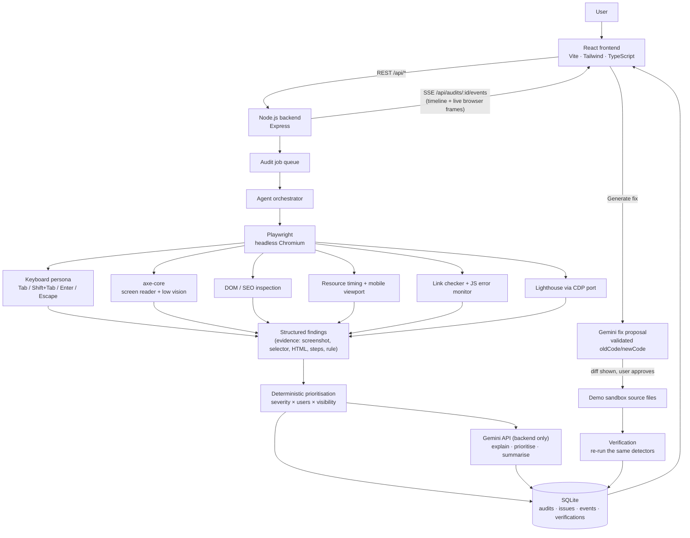

# WebGuardian AI — Architecture

WebGuardian is a full-stack application. A React frontend talks to an Express backend over REST and Server-Sent Events. The backend runs an **agent orchestrator** that drives a real Chromium browser with Playwright, runs deterministic detectors, stores evidence in SQLite, and asks **Google Gemini** (server-side only) to reason over that evidence.



```
                    USER
                      │
                      ▼
            ┌──────────────────┐
            │ React Frontend   │   landing · audit form · live agent view
            │ Vite + Tailwind  │   dashboard · issue detail · chat
            └────────┬─────────┘
                     │  REST + SSE
                     ▼
            ┌──────────────────┐
            │ Node.js Backend  │   validation · SSRF guard · rate limits
            │ Express          │
            └────────┬─────────┘
                     │  audit job (queue, max N concurrent)
                     ▼
            ┌───────────────────┐
            │ Agent Orchestrator│  crawl ≤3 pages · timeouts · detector isolation
            └────────┬──────────┘
             ┌───────┴────────┐
             ▼                ▼
      ┌─────────────┐   ┌─────────────┐
      │ Playwright  │   │ Gemini API  │  (API key only on the server)
      │ Chromium    │   │             │
      └──────┬──────┘   └──────┬──────┘
             ▼                 │
      ┌─────────────┐          │
      │ personas    │          │
      │ axe-core    │          │
      │ Lighthouse  │          │
      │ DOM · links │          │
      └──────┬──────┘          │
             └────────┬────────┘
                      ▼
              ┌───────────────┐
              │ AI Reasoning  │  explanation · priority · summary · fix
              └───────┬───────┘
                      ▼
              ┌───────────────┐
              │ Evidence Store│  SQLite + screenshots on disk
              └───────┬───────┘
                      ▼
              ┌───────────────┐
              │ Verification  │  same detectors, fingerprint comparison
              └───────┬───────┘
                      ▼
              ┌───────────────┐
              │ Dashboard     │
              └───────────────┘
```

## Key design decisions

### 1. Detection is deterministic; the AI only reasons
Every issue is produced by a detector (`backend/src/detectors`, `backend/src/personas`) and carries evidence. Gemini receives those findings and **cannot add issues**:

- Summary/prioritisation responses must reference existing issue numbers; unknown numbers are rejected (with one retry) and then filtered out.
- Chat citations are filtered against real issue numbers; off-topic questions answer *"I don't have evidence for that in this audit."*
- Fix proposals must quote `oldCode` that exists **exactly once** in the chosen source file, otherwise they are rejected.
- Every response is validated with zod (`backend/src/ai/schemas.ts`).

### 2. Personas act; they don't just inspect
The keyboard persona (`backend/src/personas/keyboard.ts`) presses real keys through Playwright. It records the focus sequence, detects when the sequence cycles within a region, then tries what a real user would try — **Escape**, then **Enter** on an "Accept/Close"-style control — before declaring a trap. It also compares each element's computed style focused vs. unfocused to detect invisible focus indicators.

### 3. Evidence
For each finding with a selector, the agent scrolls to the element, draws a highlight overlay (removed afterwards so it never affects detection) and captures a JPEG. Findings also store the CSS selector, HTML snippet, reproduction steps, detection rule and tool, and a confidence level (`high` when a deterministic tool confirms it).

### 4. Prioritisation
`backend/src/services/prioritization.ts`: `score = severity weight × users-affected factor × page-visibility factor` (homepage and navigation weigh more; blocking problems like focus traps weigh most). Users see only the label (critical/high/medium/low) and a one-sentence *"why this priority?"*.

### 5. Fix → approval → verification
- Fixes are **never** applied automatically. `POST /api/issues/:id/apply` requires `{ "approved": true }`.
- Fixes are only *applicable* to sources the server owns: each demo audit gets a private **sandbox copy** of the demo site (`/sandbox/<id>/`). For any other website the diff is shown to copy into your own code.
- Verification re-runs the same detectors in a fresh browser and compares **fingerprints** (`rule | page | element`). An issue is "resolved" only when the re-test no longer produces its fingerprint. The whole-site re-test also reports newly introduced issues.

### 6. Resilience
- Each detector is isolated; a failure marks it `failed`/`unavailable` and the audit continues (partial scan).
- Gemini failures never break an audit — the dashboard shows "AI explanation temporarily unavailable" and the deterministic explanations remain.
- Timeouts: per navigation, per Lighthouse run, per Gemini call and per audit. The crawl is limited to 3 pages with at most 9 attempts.
- Audits interrupted by a restart are marked failed on boot.

### 7. Security
- `GEMINI_API_KEY` is read only by the backend (`process.env`), never sent to the browser.
- URL validation: http/https only, no credentials, malformed hosts rejected.
- SSRF protection: DNS resolution + block of private, loopback, link-local and metadata addresses (the server's own demo origin is allow-listed). In-page sub-requests to private hosts are blocked at the browser level.
- Rate limits on audit creation, verification and AI endpoints.
- HTML snippets sent to Gemini are explicitly marked as untrusted data in the system prompt.

## Audit state machine

```
QUEUED → INITIALIZING → CRAWLING ⇄ TESTING → ANALYZING → GENERATING_REPORT → COMPLETED
                                                                              │
                                                     VERIFYING ◄──────────────┘
                                                         │
                                                         ▼
                                                     VERIFIED
(any stage) → FAILED
```

## Data model (SQLite)

| Table | Key columns |
|---|---|
| `audits` | id, url, status, progress, stage, pages, scores_before, scores_after, issue_counts, total_issues, resolved_issues, detectors, ai_summary, lighthouse, sandbox_id, last_verification, created_at, updated_at |
| `issues` | id, number, audit_id, page_url, category, persona, severity, priority_score, priority_reason, confidence, title, description, affected_users, why_it_matters, how_to_fix, selector, html_snippet, screenshot_path, steps, rule, detected_by, help_url, fingerprint, metrics, ai, fix, status, created_at |
| `events` | id, audit_id, timestamp, type, message, metadata |
| `verifications` | id, issue_id, audit_id, before_result, after_result, status, created_at |

## Source layout

```
backend/src
├── agents/        orchestrator (browser session + crawl), crawler, in-page helpers
├── personas/      keyboard-only persona, persona metadata
├── detectors/     axe-core, SEO, performance, functionality, mobile, Lighthouse, knowledge base
├── ai/            Gemini client, prompts, zod schemas, reasoning service
├── services/      audit lifecycle + verification, fixes, sandboxes, prioritisation, scoring
├── controllers/   HTTP handlers          routes/   API routes
├── database/      node:sqlite schema + repository
├── events/        live event bus (SSE)   middleware/  errors, rate limits
└── utils/         URL validation / SSRF, ids, logger
```
